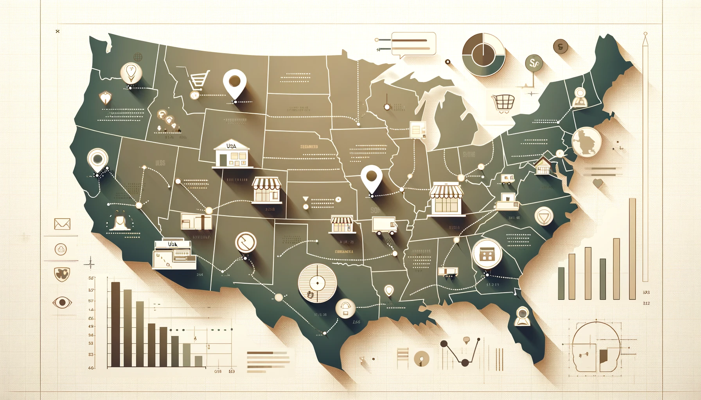

# Business Analysis for Retail Operations

# Table of Contents

- [Objective](#objective)
- [User Story](#user-story)
- [Data Source](#data-source)
- [Stages](#stages)
- [Design](#design)
  - [Dashboard components required](#dashboard-components-required)
  - [Dashboard mockup](#dashboard-mockup)
  - [Tools Used](#tools-used)
- [Development](#development)
  - [Pseudocode](#pseudocode)
  - [Data exploration notes](#data-exploration-notes)
  - [Data cleaning](#data-cleaning)
  - [Transform the data](#transform-the-data)
  - [Create the SQL view](#create-the-sql-view)
- [Testing](#testing)
  - [Row Count check](#row-count-check)
  - [Column Count check](#column-count-check)
  - [Data Type check](#data-type-check)
  - [Duplicate Count check](#duplicate-count-check)
- [Visualisation](#visualisation)
  - [Results](#results)
  - [DAX Measures](#dax-measures)
    - [Total Subscribers (M)](#total-subscribers-m)
    - [Total Views (B)](#total-views-b)
    - [Total Videos](#total-videos)
    - [Average Views Per Video (M)](#average-views-per-video-m)
    - [Subscriber Engagement Rate](#subscriber-engagement-rate)
    - [Views per subscriber](#views-per-subscriber)
- [Analysis](#analysis)
  - [Findings](#findings)
    - [Top 10 YouTubers with the most subscribers](#1-who-are-the-top-10-youtubers-with-the-most-subscribers)
    - [Top 3 channels with the most videos uploaded](#2-which-3-channels-have-uploaded-the-most-videos)
    - [Top 3 channels with the most views](#3-which-3-channels-have-the-most-views)
    - [Top 3 channels with the highest average views per video](#4-which-3-channels-have-the-highest-average-views-per-video)
    - [Top 3 channels with the highest views per subscriber ratio](#5-which-3-channels-have-the-highest-views-per-subscriber-ratio)
    - [Top 3 channels with the highest subscriber engagement rate per video uploaded](#6-which-3-channels-have-the-highest-subscriber-engagement-rate-per-video-uploaded)
  - [Notes](#notes)
  - [Validation](#validation)
    - [Youtubers with the most subscribers](#1-youtubers-with-the-most-subscribers)
    - [Youtubers with the most videos uploaded](#2-youtubers-with-the-most-videos-uploaded)
    - [Youtubers with the most views](#3-youtubers-with-the-most-views)
  - [Discovery](#discovery)
  - [Recommendations](#recommendations)
  - [Potential ROI](#potential-roi)
  - [Action plan](#action-plan)

# Objective

- What is the key objective of the project?

